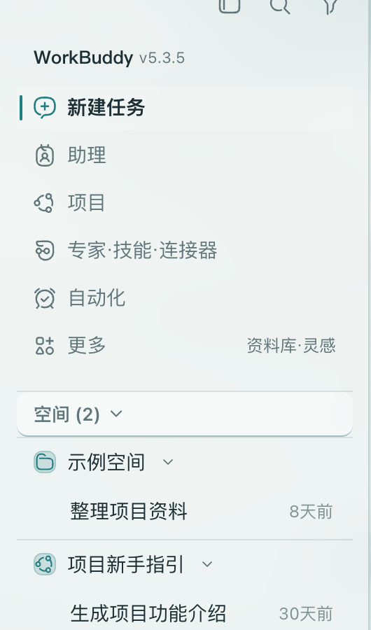
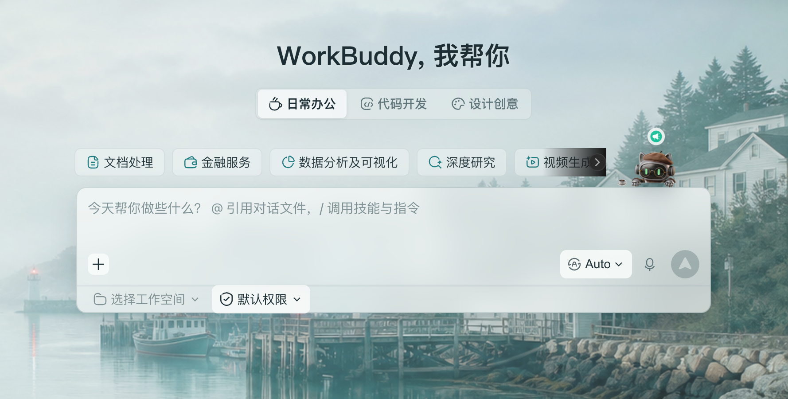
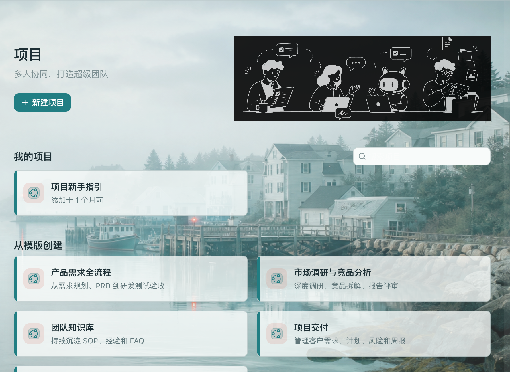
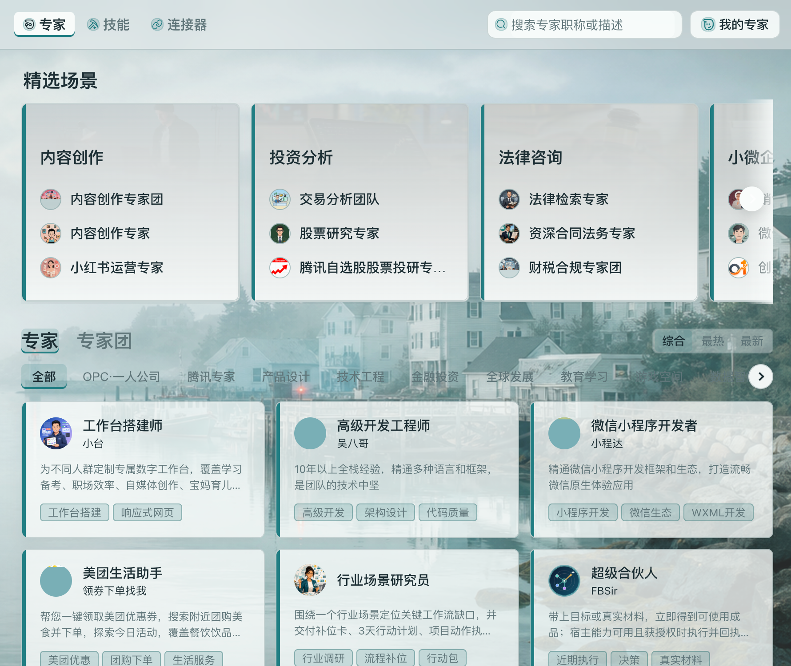
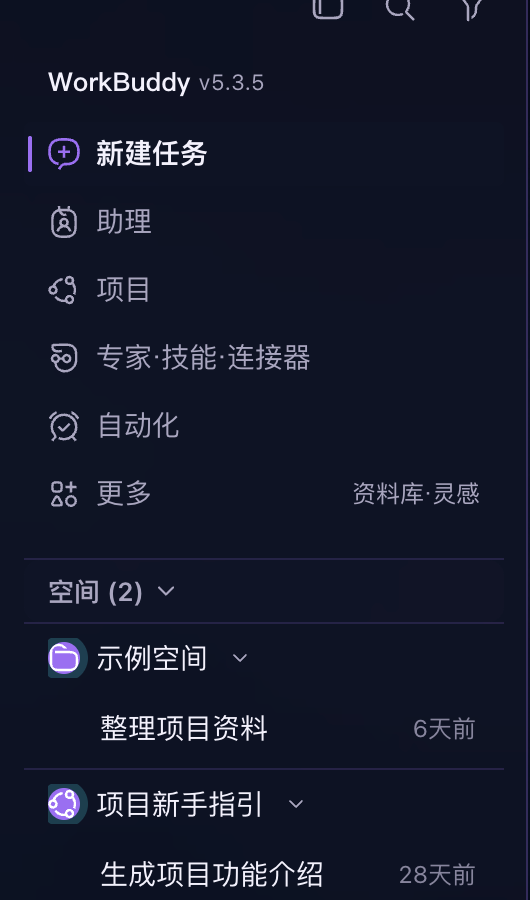
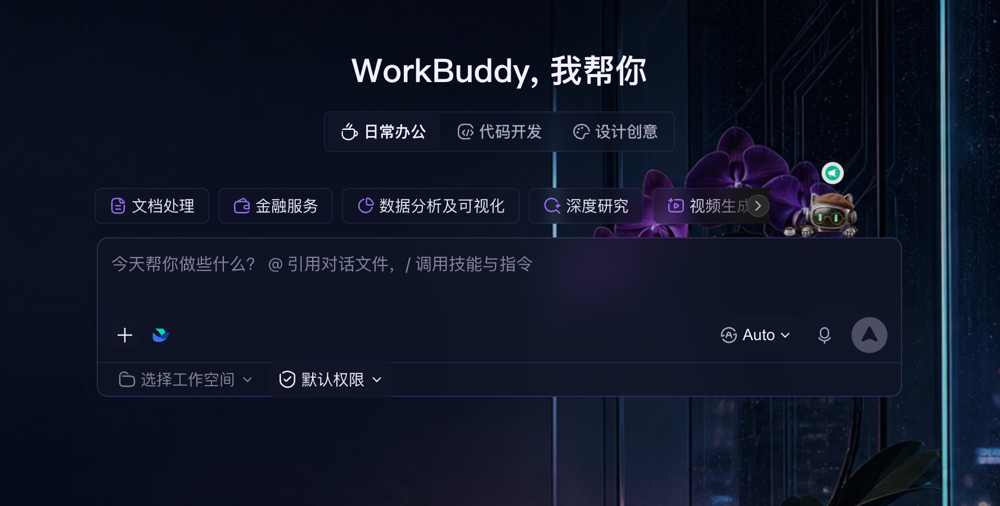
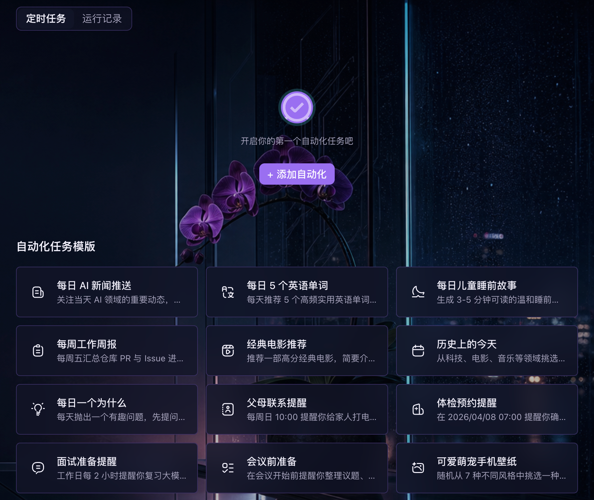
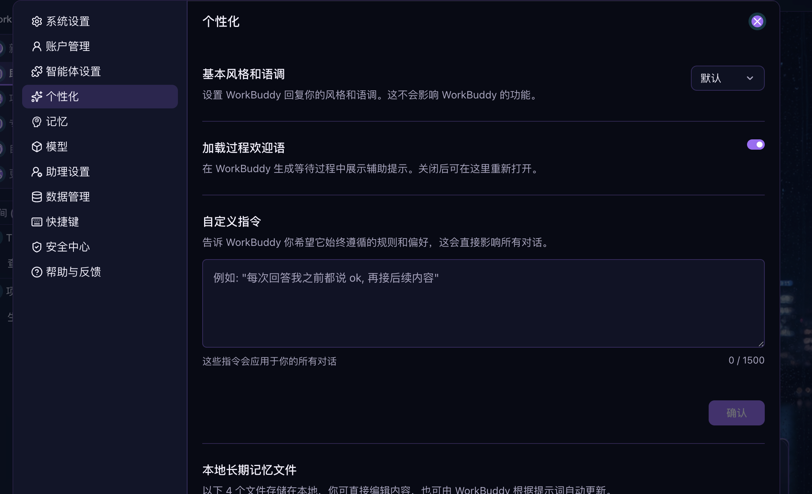

<h1 align="center">WorkBuddy Skin</h1>

<p align="center"><strong>给 WorkBuddy 换一套真正融入工作的主题。</strong></p>

<p align="center">
  10 套内置主题 · Agent 直接调用 · 本地运行 · 随时恢复
</p>

<p align="center">
  <a href="#三步开始">立即开始</a> ·
  <a href="#组件覆盖">组件范围</a> ·
  <a href="#实机组件图鉴">查看案例</a> ·
  <a href="https://github.com/l77948032-cyber/WorkBuddy-Skin/releases/latest">下载最新版</a>
</p>

<table>
  <tr>
    <td width="50%" valign="top">
      
      <br><strong>Harbor Focus</strong>
      <br><sub>明亮首页实机 · 背景、侧栏、场景标签、快捷入口与输入区</sub>
    </td>
    <td width="50%" valign="top">
      
      <br><strong>Orchid Night</strong>
      <br><sub>深色首页实机 · 导航、项目列表、圆章图标、焦点态与输入区</sub>
    </td>
  </tr>
</table>

WorkBuddy Skin 是一套交给本地编程 Agent 使用的 WorkBuddy 主题工具。你只需要描述想要的
颜色、氛围和工作状态，Agent 就能挑选模板、创建副本、继续调整，再把结果应用到
WorkBuddy。

它改变的不只是一张壁纸。首页、项目页、对话区、侧栏、输入框、按钮、选中状态和提示
都会使用同一种视觉语言；内容层保留足够的通透感，不再用大片不透明面板把背景完全盖住。

## 实机组件图鉴

下面不是概念图，也不是重新绘制的 UI。所有画面都来自 **WorkBuddy 5.3.5 · macOS**
实机截图，并从同一套主题的真实页面中截取组件细节。

### Harbor Focus · 日间专注

雾蓝、海玻璃色和轻薄表面共同作用于导航、首页、项目与能力中心。背景始终存在，但信息
层级和主要操作不会被风景淹没。

<table>
  <tr>
    <td width="35%" valign="top">
      
      <br><strong>侧栏与项目导航</strong>
      <br><sub>线性图标、青色选中轨、空间分组、项目层级与时间信息</sub>
    </td>
    <td width="65%" valign="top">
      
      <br><strong>首页操作与输入区</strong>
      <br><sub>场景切换、快捷入口、输入表面、工作空间、权限、模型、语音与发送状态</sub>
    </td>
  </tr>
</table>

<table>
  <tr>
    <td width="50%" valign="top">
      
      <br><strong>项目页</strong>
      <br><sub>主要按钮、搜索框、项目卡、模板卡、图标块与卡片强调边</sub>
    </td>
    <td width="50%" valign="top">
      
      <br><strong>专家、技能与连接器</strong>
      <br><sub>顶部标签、搜索、精选场景、分类筛选、能力卡与状态标签</sub>
    </td>
  </tr>
</table>

### Orchid Night · 深夜沉浸

深靛玻璃、兰花紫和克制的青色边光会贯穿导航、首页、自动化与设置控件。深色主题不是
把页面整体染黑，而是重新组织焦点、表面层级和操作反馈。

<table>
  <tr>
    <td width="35%" valign="top">
      
      <br><strong>侧栏与项目导航</strong>
      <br><sub>圆章图标、紫色活动轨、深色分组线、选中状态与弱化信息</sub>
    </td>
    <td width="65%" valign="top">
      
      <br><strong>首页操作与输入区</strong>
      <br><sub>夜间场景标签、快捷入口、半透明输入面板、工具栏与焦点边线</sub>
    </td>
  </tr>
</table>

<table>
  <tr>
    <td width="50%" valign="top">
      
      <br><strong>自动化</strong>
      <br><sub>页面标签、空状态、主要操作、任务模板、图标与说明层级</sub>
    </td>
    <td width="50%" valign="top">
      
      <br><strong>设置与表单</strong>
      <br><sub>设置导航、选中项、下拉框、开关、输入区、禁用按钮与分隔线</sub>
    </td>
  </tr>
</table>

## 组件覆盖

WorkBuddy Skin 调整的是一套完整视觉系统。Agent 只修改一份结构化主题，运行时就会把
背景、色彩、表面材质、图标语言和交互状态同步映射到整个 WorkBuddy，而不是只给首页
贴一张图片。

<table>
  <tr>
    <td align="center" width="25%"><strong>8</strong><br><sub>类核心页面</sub></td>
    <td align="center" width="25%"><strong>32</strong><br><sub>个界面组件</sub></td>
    <td align="center" width="25%"><strong>18</strong><br><sub>个色彩角色</sub></td>
    <td align="center" width="25%"><strong>5</strong><br><sub>组交互反馈</sub></td>
  </tr>
</table>

### 一套主题具体会覆盖什么

| 界面范围 | 组件 | 会同步变化的可见元素 |
| --- | --- | --- |
| **工作区骨架** | `shell.workspace`、`shell.titlebar` | 应用背景、内容表面、环境装饰、标题栏与窗口操作 |
| **侧栏与项目导航** | `sidebar.navigation`、`sidebar.project` | 入口图标、选中标记、项目和对话分组、分隔线、元信息 |
| **WorkBuddy 首页** | `home.hero`、`home.quickAction` | 欢迎标题、场景标签、快捷任务卡、图标块、悬停和焦点反馈 |
| **对话内容** | `chat.timeline`、`chat.message.user`、`chat.message.agent`、`chat.toolCall` | 对话时间线、用户消息、Agent 回复、附件、工具调用、审批与执行状态 |
| **输入与主要操作** | `composer.surface`、`composer.tool`、`action.primary` | 输入面板、焦点环、模型/附件/技能/语音控件、发送与确认按钮 |
| **结果与文件** | `result.shell`、`result.tabs`、`result.artifact`、`result.fileTree` | 结果面板、活动标签、产物卡、文件树、选中项与增删改状态 |
| **专家、技能与连接器** | `market.toolbar`、`market.card` | 搜索、分类、筛选、能力卡片、标签、安装状态与操作反馈 |
| **自动化** | `automation.task`、`automation.run` | 自动化任务卡、启用状态、运行历史、耗时及成功/警告/错误状态 |
| **项目与设置** | `project.card`、`settings.section` | 项目卡、活动信息、成员入口、设置分组、偏好项和控件状态 |
| **通用控件与反馈** | `input.field`、`selection.control`、`overlay.menu`、`overlay.dialog`、`overlay.tooltip`、`status.badge`、`status.toast`、`loading.skeleton`、`empty.state` | 输入和选择、菜单和弹窗、Tooltip、状态徽标、通知、加载与空状态 |

这些组件覆盖首页、助手、对话、结果、能力中心、自动化、项目和设置 8 类页面。结果区还会
同步 WorkBuddy 编辑器、标签、按钮、终端等基础界面色彩，但不会替换代码语法配色方案。

### CLI 真正可以调整的元素

| 主题层 | 可以修改 | 最终影响 |
| --- | --- | --- |
| **背景构图** | 图片、位置、缩放、透明度、叠色、混合模式、饱和度 | 决定主题场景如何进入工作区，同时保留正文可读性 |
| **18 个色彩角色** | 背景、两级面板、主/辅强调色、文字、弱化文字、边线、选区、终端、成功、警告、错误、信息和禁用色等 | 让导航、正文、按钮、文件状态与反馈使用统一配色 |
| **表面与层级** | 内容区和侧栏透明度、模糊、圆角、明暗模式 | 控制玻璃感、纸面感、层级分隔与背景露出程度 |
| **5 个交互状态** | 悬停、按下、焦点、Tooltip 背景和 Tooltip 文字 | 让鼠标、键盘与禁用状态依旧清楚可辨 |
| **组件视觉语言** | 图标处理、表面处理、卡片处理、主题纹理与装饰语言 | 让快捷入口、能力卡、项目卡和浮层不只是换颜色 |

> **能力边界：**32 类组件不是 32 个互不关联的样式开关。CLI 修改的是一套全局主题
> 规则，再由运行时一致地映射到这些组件。因此界面不会东一块、西一块；它改变视觉呈现，
> 但不会修改 WorkBuddy 的功能、内容或信息结构。

## 更多主题方向

<table>
  <tr>
    <td width="50%" valign="top">
      
      <br><strong>City Rain</strong>
      <br><sub>午夜雨幕 · 城市灯火与深蓝玻璃</sub>
    </td>
    <td width="50%" valign="top">
      
      <br><strong>Winter Lodge</strong>
      <br><sub>雪山木屋 · 壁炉暖光与深木工作台</sub>
    </td>
  </tr>
  <tr>
    <td width="50%" valign="top">
      
      <br><strong>Paper Garden</strong>
      <br><sub>压花纸艺 · 适合长时间阅读与整理</sub>
    </td>
    <td width="50%" valign="top">
      
      <br><strong>Orbit Console</strong>
      <br><sub>轨道控制台 · 面向复杂任务的精密深色界面</sub>
    </td>
  </tr>
</table>

上面展示的是主题视觉方向。实际应用后，导航、组件、交互状态与内容层也会同步变化。

## 10 套内置主题

| 主题 | 视觉方向 | 主题 | 视觉方向 |
| --- | --- | --- | --- |
| **Harbor Focus** | 雾蓝海港与海玻璃 | **Orchid Night** | 深靛兰花与青色边光 |
| **City Rain** | 午夜雨幕与城市灯火 | **Winter Lodge** | 雪山木屋与壁炉暖光 |
| **Paper Garden** | 压花植物与纤维纸 | **Orbit Console** | 轨道舷窗与航天控制台 |
| **Ink Courtyard** | 水墨雨院与朱砂印记 | **Forest Notes** | 雨后森林与植物手记 |
| **Coral Studio** | 爱琴海光线与珊瑚拼贴 | **Desert Dawn** | 沙漠晨光与赤陶建筑台 |

每套模板都可以复制成自己的主题。原模板保持不变，你可以继续让 Agent 调整配色、背景、
表面透明度、焦点和组件细节，也可以从空白主题开始创造。

## 把它交给你的 Agent

你可以直接这样说：

> 给 WorkBuddy 找一套适合夜间长时间工作的主题，背景要有存在感，但文字不能被干扰。

> 以 Harbor Focus 为基础做一个更清爽的版本，降低卡片白度，把当前项目的焦点再加强。

> 先预览这个主题并截图，确认首页、项目页和对话页都清楚后再应用。

> 帮我把 WorkBuddy 恢复成原生界面。

Agent 可以直接调用 `workbuddy-skin` 完成这些操作，无需 ACP、MCP Server 或额外桌面管理
应用。

## 三步开始

### 1. 安装

需要 macOS 与 Node.js `22.12` 或更高版本。

```bash
npm install --global github:l77948032-cyber/WorkBuddy-Skin
```

### 2. 从模板创建自己的主题

```bash
workbuddy-skin templates
workbuddy-skin template install orchid-night --as my-night
```

### 3. 应用到 WorkBuddy

```bash
workbuddy-skin apply my-night
```

预览、检查与恢复：

```bash
workbuddy-skin preview my-night --screenshot "$PWD/preview.png"
workbuddy-skin verify --screenshot "$PWD/current.png"
workbuddy-skin restore
```

所有命令只面向 WorkBuddy，不需要选择目标或版本。

## 为什么可以放心尝试

- **本地运行**：主题、图片和运行状态留在你的电脑上。
- **明确应用**：创建和修改主题不会自动改变 WorkBuddy，应用操作始终单独执行。
- **先预览再决定**：可以生成真实截图检查结果，再决定是否保留。
- **随时恢复**：`restore` 会移除主题效果，让 WorkBuddy 回到原生界面。
- **不替换界面文件**：主题通过本地运行时呈现，不覆盖 WorkBuddy 原有界面资源。
- **不需要 Apple 证书**：这是 CLI，不是需要签名安装的 macOS 应用。

当前已在 **WorkBuddy 5.3.5 · macOS** 完成首页、项目、能力中心、自动化与设置页面的
实机主题截图验证。WorkBuddy 更新界面后，个别组件可能需要重新适配，欢迎附版本号与
截图反馈。

## 常见问题

<details>
<summary><strong>关闭终端后，主题会消失吗？</strong></summary>
<br>
不会因为命令结束而立即消失。需要结束时，主动执行
<code>workbuddy-skin restore</code>。
</details>

<details>
<summary><strong>可以完全制作自己的主题吗？</strong></summary>
<br>
可以。你可以复制任意模板继续修改，也可以让 Agent 从空白主题开始生成，并导入自己的
PNG、JPEG 或 WebP 背景。
</details>

<details>
<summary><strong>应用之前能看到实际效果吗？</strong></summary>
<br>
可以。<code>preview</code> 会临时应用主题并生成实机截图，然后恢复此前状态。
</details>

<details>
<summary><strong>WorkBuddy 更新后效果异常怎么办？</strong></summary>
<br>
先执行验证或恢复，再附上 WorkBuddy 版本、macOS 版本和截图提交 Issue。应用界面升级后，
部分组件可能需要重新适配。
</details>

## 一起把 WorkBuddy 变得更有趣

欢迎分享主题灵感、实机截图和兼容性反馈，也欢迎通过 Pull Request 提交新的主题模板。

- [下载最新版本](https://github.com/l77948032-cyber/WorkBuddy-Skin/releases/latest)
- [提交问题或建议](https://github.com/l77948032-cyber/WorkBuddy-Skin/issues)
- [查看完整命令说明](./docs/agent-tool-v1.md)
- [素材与来源说明](./NOTICE.md)

本项目采用 [MIT License](./LICENSE)。WorkBuddy Skin 是非官方社区项目，不代表
WorkBuddy、ByteDance、OpenAI 或相关产品方。
