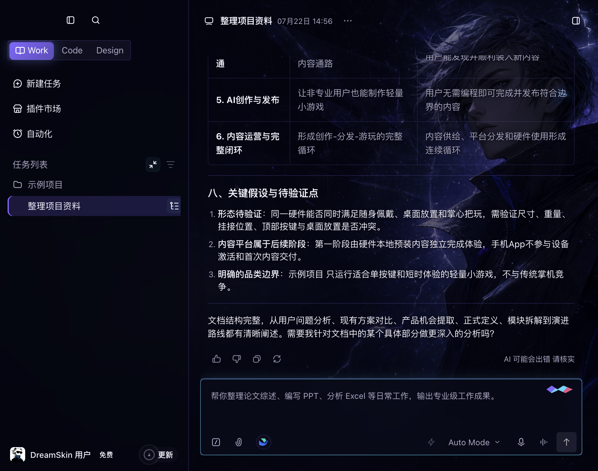
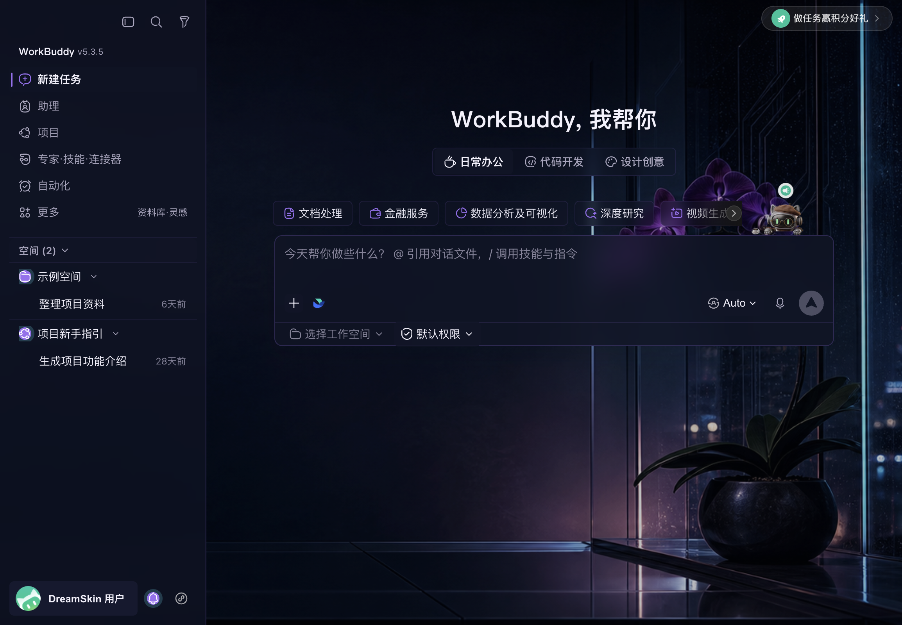

<h1 align="center">Agent Dream Skin</h1>

<p align="center"><strong>让 Trae 和 WorkBuddy，真正长成你喜欢的样子。</strong></p>

<p align="center">
  20 套内置主题 · 本地运行 · Agent 直接调用 · 随时恢复原生界面
</p>

<p align="center">
  <a href="#三步开始">立即开始</a> ·
  <a href="#20-套内置主题">浏览主题</a> ·
  <a href="https://github.com/l77948032-cyber/Agent-Dream-Skin/releases/latest">下载最新版</a>
</p>



<p align="center"><sub>Violet Rift · Trae 实机效果</sub></p>

Agent Dream Skin 是一套给本地编程 Agent 使用的主题工具。你只需要说出想要的感觉，
Agent 就能通过 `skin-cli` 为 Trae 或 WorkBuddy 挑选、创建、调整、预览并应用主题。

它不是多装一个管理器，也不需要常驻服务器。主题能力直接交给你已经在使用的 Agent，
让换肤成为工作流的一部分。

## 不只是换一张背景

真正的主题，不应该只是把壁纸贴在界面后面。

Dream Skin 会让背景、侧栏、导航、对话区域、输入框、按钮、选中状态、通知和浮层使用
同一套视觉语言。背景保留存在感，内容仍然清晰，常用操作也不会被装饰遮住。

| 整套界面一起变化 | 直接告诉 Agent | 随时回到原生界面 |
| --- | --- | --- |
| 从首页到对话页，从导航到输入区，都围绕同一种气质设计。 | 不必先学习主题配置，用自然语言描述颜色、氛围和细节。 | 先预览、再应用；不喜欢时，一条命令即可恢复。 |

## 两个工作空间，两种完整体验

### Trae：让编码空间拥有自己的世界

Trae 的 Work、Code、Design、任务列表、对话内容和输入区域会作为一个整体换肤。
明亮插画、深色幻想、纸艺质感、东方庭院或霓虹空间，都不再只是背景图，而会延伸到
按钮、边框、选中态和内容层级。

Trae CN 与 Trae International 使用同一个目标、同一套主题库和同一组命令，不需要
分别安装两套工具。

### WorkBuddy：让日常工作台更有自己的气质



<p align="center"><sub>Orchid Night · WorkBuddy 实机效果</sub></p>

WorkBuddy 的首页、空间、项目、技能、自动化、对话输入和状态反馈都会跟随主题变化。
背景可以自然地留在工作区里，同时保持按钮、文字和输入区域清楚可用。

## 20 套内置主题

项目目前为 Trae 和 WorkBuddy 各准备了 10 套主题。每套都可以作为起点，复制成自己的
版本后继续修改。

| Trae 主题 | 视觉方向 | WorkBuddy 主题 | 视觉方向 |
| --- | --- | --- | --- |
| **Violet Rift** | 深色幻想与紫色微光 | **Orchid Night** | 兰花夜景与深靛玻璃 |
| **Sunlit Spark** | 明亮插画与轻盈纸面 | **City Rain** | 城市夜雨与安静霓虹 |
| **Paper Aurora** | 柔和纸艺与极光色彩 | **Paper Garden** | 明亮纸艺与植物细节 |
| **Spark Atelier** | 手作感创意工作室 | **Harbor Focus** | 雾蓝港湾与专注氛围 |
| **Midnight Library** | 午夜书房与沉浸阅读 | **Forest Notes** | 森林手记与自然绿色 |
| **Alpine Signal** | 雪山、信号与清冷空气 | **Winter Lodge** | 冬日木屋与温暖灯光 |
| **Jade Courtyard** | 东方庭院与玉石色彩 | **Ink Courtyard** | 水墨庭院与克制留白 |
| **Cosmic Arcade** | 宇宙街机与活力色彩 | **Orbit Console** | 轨道控制台与科技界面 |
| **Ember Glass** | 余烬、珊瑚与玻璃材质 | **Coral Studio** | 珊瑚色创作空间 |
| **Neon Portal** | 青绿与玫红霓虹入口 | **Desert Dawn** | 沙漠晨光与低饱和暖色 |

## 把它交给你的 Agent

你可以直接这样说：

> 给 Trae 找一套深色主题，背景要有存在感，但对话内容必须清楚。

> 以 Paper Aurora 为基础做一个更安静的晚间版本，降低装饰亮度，保留输入框对比度。

> 先在 WorkBuddy 里预览 Orchid Night，确认背景、侧栏和输入区都正常后再应用。

> 帮我恢复 Trae 的原生界面。

你正在使用的编程 Agent 可以调用 `skin-cli` 完成这些操作。无需 ACP、MCP Server 或额外
的桌面 Studio，主题创建和应用都发生在本机。

## 三步开始

### 1. 安装

需要 Node.js `22.12` 或更高版本。

```bash
npm install --global github:l77948032-cyber/Agent-Dream-Skin
```

### 2. 选择一套主题

```bash
skin-cli templates --target trae
skin-cli template install violet-rift --as my-violet --target trae
```

### 3. 应用到 Trae

```bash
skin-cli apply my-violet --target trae --edition auto
```

只安装了一个 Trae 版本时，`auto` 会自动选择。CN 与 International 同时安装时，可以
明确使用 `--edition cn` 或 `--edition international`。

为 WorkBuddy 添加并应用主题：

```bash
skin-cli template install orchid-night --as night-work --target workbuddy
skin-cli apply night-work --target workbuddy
```

恢复原生界面：

```bash
skin-cli restore --target trae --edition auto
skin-cli restore --target workbuddy
```

## 为什么可以放心尝试

- **本地运行**：主题、图片和运行状态都留在你的电脑上。
- **明确应用**：Agent 可以设计和检查主题，但真正应用仍是一条清楚可见的命令。
- **先验证再使用**：工具会确认目标应用、主题内容和实际渲染状态。
- **随时恢复**：`restore` 会移除 Dream Skin 效果，让应用回到原生界面。
- **不替换界面文件**：主题通过本地运行时呈现，不覆盖目标应用原有的界面资源。
- **不需要 Apple 证书**：这是命令行工具，不是需要签名安装的 macOS 应用。

## 当前支持

| 目标应用 | 当前状态 |
| --- | --- |
| **TRAE SOLO CN** | macOS 实机验证，使用统一的 Trae 主题库。 |
| **Trae International** | 与 CN 共用同一个 Trae 目标和主题，持续进行更多版本兼容验证。 |
| **WorkBuddy** | macOS 实机验证，当前重点适配 WorkBuddy `5.3.5`。 |
| **Windows** | 已包含 Trae 运行支持，仍需要更多真实设备反馈。 |

目标应用升级后，界面结构可能发生变化。如果主题效果异常，请附上应用版本、系统版本和
截图提交 Issue。

## 常见问题

<details>
<summary><strong>需要一直开着终端吗？</strong></summary>
<br>
不需要。应用主题后，本地运行时会维持效果。需要结束主题时，执行
<code>skin-cli restore</code>。
</details>

<details>
<summary><strong>Trae CN 和 International 是两套主题吗？</strong></summary>
<br>
不是。它们是同一个 Trae 目标的两个版本，共用模板、主题和修改结果。
</details>

<details>
<summary><strong>可以完全做自己的主题吗？</strong></summary>
<br>
可以。你可以复制任意模板继续调整，也可以让 Agent 从空白主题开始生成。
</details>

<details>
<summary><strong>关闭 Agent 后，主题会消失吗？</strong></summary>
<br>
不会因为对话结束或终端关闭而立即消失。主题是否继续显示由目标应用的本地主题会话管理，
需要恢复时主动执行 <code>restore</code>。
</details>

<details>
<summary><strong>这是 Trae 或 WorkBuddy 的官方项目吗？</strong></summary>
<br>
不是。Agent Dream Skin 是非官方社区项目，不代表相关产品方。
</details>

## 一起把主题做得更丰富

欢迎分享主题灵感、截图、目标应用建议和兼容性反馈。也欢迎通过 Pull Request 提交新的
主题模板。

- [下载最新版本](https://github.com/l77948032-cyber/Agent-Dream-Skin/releases/latest)
- [提交问题或建议](https://github.com/l77948032-cyber/Agent-Dream-Skin/issues)
- [查看完整命令说明](./docs/agent-tool-v1.md)
- [查看发布与验收说明](./docs/release-checklist.md)
- [素材与来源说明](./NOTICE.md)

本项目采用 [MIT License](./LICENSE)。外部注入思路参考了
[Fei-Away/Codex-Dream-Skin](https://github.com/Fei-Away/Codex-Dream-Skin)。

Agent Dream Skin 是非官方社区项目，不代表 Trae、WorkBuddy、ByteDance、OpenAI 或相关
产品方。
