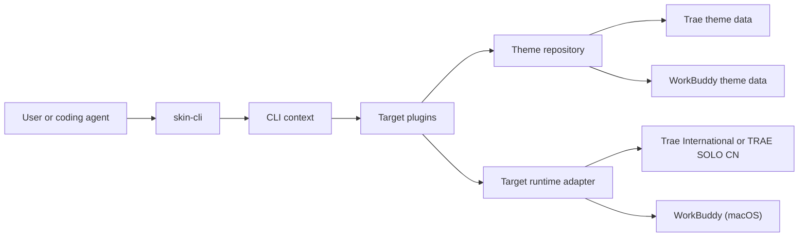

# skin-cli Architecture

`skin-cli` is a local Node.js CLI. It has no graphical management application,
HTTP service, or cloud control plane. A command builds a local application
context, routes the request to the selected first-party target plugin, then exits.

## Target Isolation

The built-in plugins are `dreamskin.trae` and `dreamskin.workbuddy`. Their
themes, locks, transaction backups, runtime state, and plugin resources are
separate. The friendly `--target` values `trae` and `workbuddy` resolve to those
plugin IDs; all output scopes include the chosen ID so callers can verify the
boundary.

The Trae plugin handles Trae International and TRAE SOLO CN. The WorkBuddy
plugin is available only on macOS. Runtime commands accept
`--edition auto|international|cn` for Trae; explicit selection prevents two
installed editions from being chosen by discovery order. Use `skin-cli targets`
and `skin-cli doctor` instead of assuming a host exists or is ready.

## Command Boundaries

`src/cli.mjs` strictly parses command lines and emits one JSON envelope. The
theme repository accepts schema-valid structured theme data and exposes
inspection, list/read, create/update/delete, validation, and guarded image
import. Runtime adapters expose status, apply, verify, preview, and restore for
the target named by the command.

Theme mutations use an optimistic SHA-256 revision and repository lock. The
repository validates the complete staged result, records a transaction backup,
and atomically replaces the live theme. This avoids partial writes and silent
last-writer-wins behavior.

Runtime actions use fixed plugin-owned scripts and arguments. User input cannot
become arbitrary CSS, DOM selectors, JavaScript, shell commands, or a target
application file path. The only caller-supplied asset path is validated by
`theme asset import` before its bytes are copied into the managed library.

Trae International and TRAE SOLO CN are host editions of the same
`dreamskin.trae` target. They deliberately share one theme library and command
surface; `--edition` selects the local host process only.

## Data And Recovery

The CLI has a managed data root containing target-specific theme, backup, and
runtime-state roots. Paths are environment-specific, so use
`skin-cli paths [--target ...]` to inspect them. Direct edits are unsupported:
they can bypass validation, revisions, locks, and transaction recovery.

When an earlier DreamSkin Studio data root already exists, the first CLI-only
release reuses it in place and reports `usingLegacyDataRoot: true`. New
installations use the CLI-owned `DreamSkin/data` root.

Repository backups exist to recover interrupted theme writes. `skin-cli restore`
is separate: it tells the selected runtime adapter to remove the active skin and
return the target application to its native state. It does not select or replay
a historical theme backup.

## Packaging And Release

The npm package exposes `skin-cli` from `bin/skin-cli.mjs` and bundles only the
CLI runtime, target plugins, schemas, assets, and fixed runtime scripts. Package
verification rejects non-CLI application sources and build resources.

The GitHub release workflow runs Node checks and tests, creates an npm tarball,
installs that tarball globally into a temporary prefix for smoke testing,
generates `SHA256SUMS.txt`, and attaches both files to the GitHub Release. It
does not publish to npm; registry publication is an explicit separate action.
