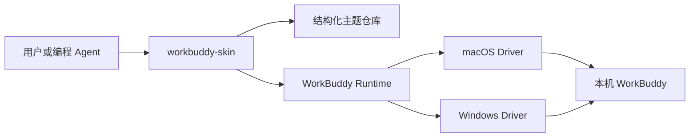

# WorkBuddy Skin 运行方式

WorkBuddy Skin 是纯本地 Node.js CLI，没有桌面管理界面，也不需要单独部署服务。主题启用
期间只有一个随 WorkBuddy 会话运行的本地 watcher，用于在页面切换后恢复主题。

主题仓库负责模板复制、资源导入、revision 冲突检测和事务恢复。Runtime 仅连接
本机回环 CDP 端点，不修改 WorkBuddy 应用包，并在应用、验证和恢复之间保持
可检查的运行状态。

CLI 固定注册 `dreamskin.workbuddy` 插件。插件拥有自己的模板、schema、组件 registry
和运行映射。macOS 与 Windows 只在发现客户端、校验签名、管理进程和持久化会话时分流；
主题载荷、组件映射、CDP 身份校验、截图与恢复语义保持一致。npm 包中不包含其他产品的
目标运行时。
