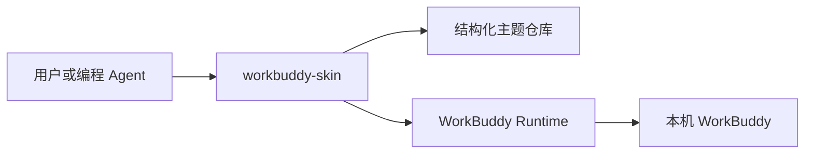

# WorkBuddy Skin 运行方式

WorkBuddy Skin 是纯本地 Node.js CLI，没有桌面管理界面，也不需要常驻服务。

主题仓库负责模板复制、资源导入、revision 冲突检测和事务恢复。Runtime 仅连接
本机回环 CDP 端点，不修改 WorkBuddy 应用包，并在应用、验证和恢复之间保持
可检查的运行状态。

CLI 固定注册 `dreamskin.workbuddy` 插件。插件拥有自己的模板、schema、组件
registry、运行映射和 macOS 启动脚本，npm 包中不包含其他目标运行时。
